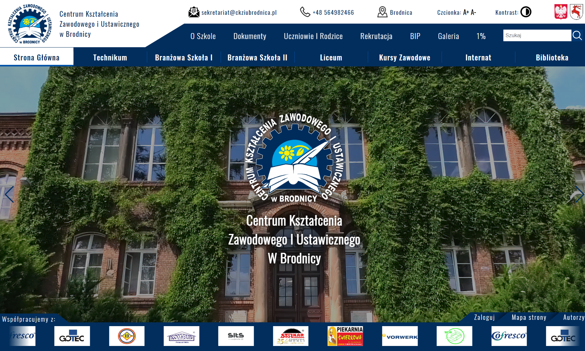
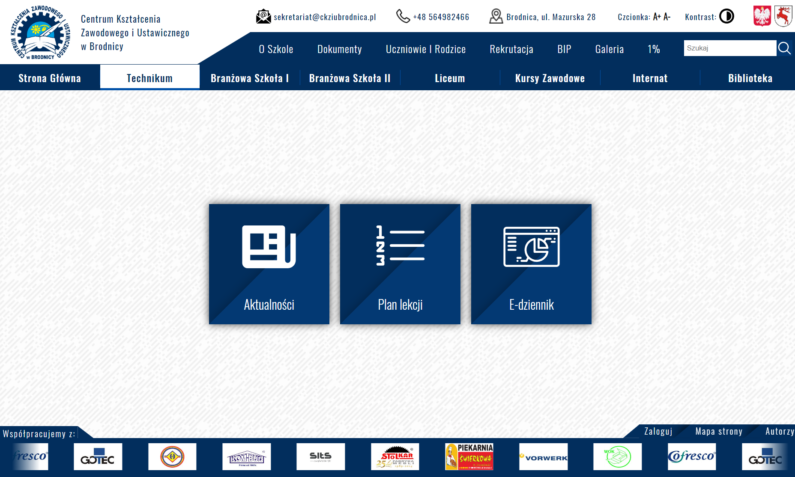
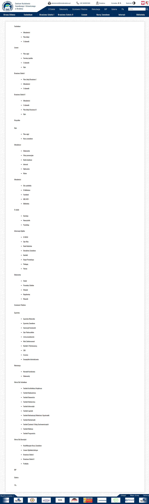

# School Page NodeJS React

## Table Of Content

- [Description](#description)
- [Deployed website link](#deployedWebsite)
- [Installation](#installation)

- [GitHub](#github)
- [Contact](#contact)
- [License](#license)

## Description

My motivation was the desire to learn new things and to get to know programming. I learned how to publish a website based on Node.JS and React on external hosting, manage a database, and expand my knowledge about APIs.

Deployed website: <strong><a href="https://ckziubrodnica.pl">https://ckziubrodnica.pl</a></strong>

   
Main page

   
  School subpage

   
Map page

## Installation

For front-end and back-end

npm install

To start the front-end

cd frontend

npm run start

To start the back-end

cd backend

npm run watch

School Page NodeJS React is built with the following tools and libraries: <ul><li>Node.JS</li> <li>React</li> <li>MySQL</li> <li>Express.JS</li> <li>Multer</li> <li>Sharp</li> <li>TinyMCE</li> <li>JSON WEB TOKEN</li></ul>

## GitHub

<a href="https://github.com/kacper0276"><strong>kacper0276</a></strong>

## Contact

Feel free to reach out to me on my email:
kacper0276@op.pl

## License

